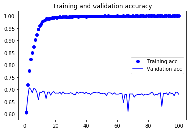
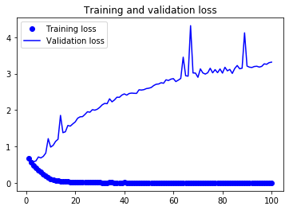

# Word Embedding Assignment

Deep Learning for NLP is pattern recognition applied to words, sentences, and paragraphs, in much the same way that computer vision is pattern recognition to pixels.Like all other neural networks, deep-learning models don't take as input raw text: they only work with numeric tensors. Vectorizing text is the process of transforming text into numeric tensors. This Assignment we will be using the most popular method Word Embedding to find out how it works.

# Steps we followed

Read IMDB Data Create Tokenizer , Fit it to the Texts and create a sequence of texts from the tokenizer Create a dictionary of the word and respective numeric index value Define the sequence with the numeric indexes Shuffle the indices as the data are normally in group for each label Segreegate data for training and validation Load Glove Models Read the embedding file and load the data Define a blank Embedding_matrix Update Embedding matrix by reading sequentially using the Embedding Index Define a Sequential model Set the weights to the Embedding matrix freeze the Embedding layer (set its trainable attribute to False) as we are using a pretrained model Compile and train the model

# Result

We got accuracy around 69% which is not great but we also need to consider the simplicity of the model used. We are not focusing on the model accuracy rather understanding the word embedding method. In our future assignments we will be working on optimizing the models . Let's see the charts to understand how the accuracy and loss varied over epochs .

          

# Summary

Word Embedding is the most advanced and the best method to convert the texts into vectors for training. Even though there are many other methods available loke One hot encoding (OHE) and cher2vec etc.. , however Word Embedding has its own set of advantages which is over powering the rest for now .
